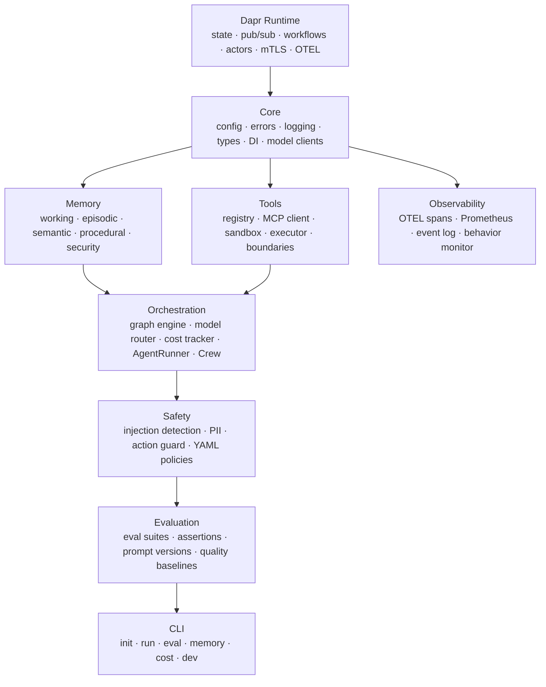

# Nexus — Production-Grade Agentic AI Framework

<p align="center">
  
</p>

<p align="center">
  <a href="https://pypi.org/project/nexus-ai/"></a>
  <a href="https://pypi.org/project/nexus-ai/"></a>
  <a href="LICENSE"></a>
  <a href="https://github.com/nexus-ai/nexus-agentic-platform/actions/workflows/ci.yml"></a>
  <a href="https://codecov.io/gh/nexus-ai/nexus-agentic-platform"></a>
</p>

> As simple as CrewAI to start. As powerful as LangGraph for production.

Nexus is an open-source agentic AI framework built on [Dapr](https://dapr.io/)'s distributed runtime. It provides everything agents need to be production-ready — persistent memory, orchestration, safety guardrails, and full observability — while Dapr handles the hard infrastructure problems: durable state, pub/sub messaging, distributed locks, mTLS, and workflow checkpointing.

---

## Why Nexus

- **Production memory architecture.** Four complementary memory types (working, episodic, semantic, procedural) with SHA-256 provenance tracking, trust scoring, and injection detection. Memory poisoning attacks are blocked at write time, not detected after the fact.
- **Built-in safety, not bolted on.** A multi-layer safety pipeline intercepts every LLM call, tool call, and memory write. Prompt injection detection, PII redaction, per-agent action boundaries, and configurable YAML policies ship in the box.
- **Dapr infrastructure means zero distributed-systems boilerplate.** Swap your state backend from PostgreSQL to DynamoDB with a one-line YAML change. mTLS between agents is zero-configuration. Workflow checkpoints survive process crashes.

---

## Features

| | Feature | Description |
|---|---|---|
| 🧠 | **Four memory types** | Working (token-aware, auto-summarized), episodic (cross-session, temporally decayed), semantic (SPO facts, confidence-weighted), procedural (learned workflows) |
| 🔒 | **Memory security** | SHA-256 provenance on every write, trust scoring with temporal decay, injection detection, rate limiting, audit integrity verification |
| 🔀 | **ReAct + Graph orchestration** | Async graph engine with conditional routing, parallel branches, and checkpoint/restore. Pre-built LLM, Tool, Human, Conditional, and Subgraph nodes |
| 👥 | **Multi-agent crews** | Sequential, parallel, and hierarchical coordination. Distributed locks for shared state. Supervisor pattern with delegation |
| 📊 | **15-assertion eval framework** | Contains, regex, tool assertions, JSON schema, LLM-as-judge, semantic similarity, PII/injection safety, cost/latency/step limits. A/B prompt testing, quality baselines |
| 🛡️ | **Safety pipeline** | Multi-layer prompt injection detection (regex + heuristic, 3 strictness levels), PII detection for 6 entity types (log/redact/block), cost guards, action allowlists |
| 📡 | **OTEL observability** | Six custom span types with model, token, cost, and duration attributes. Prometheus metrics endpoint. Immutable event log. Anomaly detection |
| 📦 | **Sandboxed tool execution** | Docker container sandbox with resource limits and network isolation. Subprocess fallback for development. LLM-generated Python executes safely |
| 🔌 | **MCP protocol support** | JSON-RPC 2.0 MCP client discovers and invokes any MCP-compatible tool server. External tool results tagged with provenance |
| ⚡ | **CLI developer experience** | `nexus init` scaffolds a runnable project in under 10 seconds. `nexus dev` launches everything with hot-reload, live cost display, and trace streaming |

---

## Architecture

Nexus is organized in nine layers, each building on the one below it:



---

## Quickstart

**Prerequisites:** Python 3.12+, Docker, [uv](https://docs.astral.sh/uv/)

```bash
# Install Nexus
pip install nexus-ai[anthropic]

# Scaffold a new project
nexus init hello-agent
cd hello-agent

# Start local infrastructure (Dapr + PostgreSQL + Redis)
docker compose up -d
```

Write your agent in `agent.py`:

```python
import asyncio
import os

from nexus.core.models.anthropic import AnthropicClient
from nexus.core.types import AgentDefinition
from nexus.orchestration.runner import AgentRunner, RunnerConfig
from nexus.tools.executor import ToolExecutor
from nexus.tools.registry import ToolRegistry


def create_runner() -> AgentRunner:
    client = AnthropicClient(api_key=os.environ["NEXUS_MODEL__ANTHROPIC_API_KEY"])
    registry = ToolRegistry()

    # Register a tool with the decorator API
    @registry.tool(name="get_weather", description="Get the current weather for a city")
    async def get_weather(city: str) -> str:
        return f"Sunny, 22°C in {city}"  # replace with real API call

    executor = ToolExecutor(registry)
    config = RunnerConfig(max_iterations=5, enable_memory=True)
    return AgentRunner(model_client=client, tool_executor=executor, config=config)


def create_agent_def() -> AgentDefinition:
    return AgentDefinition(
        name="weather-agent",
        model="claude-sonnet-4-6",
        system_prompt="You are a helpful assistant. Use tools when needed.",
        tools=["get_weather"],
    )


async def main() -> None:
    runner = create_runner()
    agent = create_agent_def()

    result = await runner.run(agent, "What's the weather in Tokyo?", session_id="s1")
    print(f"Output: {result.output}")
    print(f"Cost:   ${result.token_usage.cost_usd:.6f}")


if __name__ == "__main__":
    asyncio.run(main())
```

```bash
# Run the agent
nexus run agent.py --input "What's the weather in Tokyo?"
# Output: The current weather in Tokyo is sunny with a temperature of 22°C.
# Cost:   $0.000021
```

---

## Installation

```bash
# Core framework
pip install nexus-ai

# With Anthropic support (Claude)
pip install nexus-ai[anthropic]

# With OpenAI support (GPT-4o, o1)
pip install nexus-ai[openai]

# Both providers
pip install nexus-ai[all]
```

**Using uv (recommended):**

```bash
uv add nexus-ai[anthropic]
```

Requires Python 3.12 or 3.13. Dapr 1.17+ and Docker are required for memory persistence and sandboxed tool execution.

---

## CLI

| Command | Description |
|---|---|
| `nexus init <name>` | Scaffold a new agent project with infrastructure, config, and example code |
| `nexus run <agent.py>` | Run an agent in interactive REPL mode or single-shot with `--input` |
| `nexus eval <suite.py>` | Execute an evaluation suite; exit non-zero if pass rate falls below `--fail-under` |
| `nexus memory inspect <agent_id>` | Display an agent's current memory state across all four memory types |
| `nexus cost` | Show token usage and cost summary for recent sessions |
| `nexus dev` | Start everything in watch mode with hot-reload, live cost tracking, and trace streaming |

All commands support `--help`.

---

## Documentation

Full documentation is at **[nexus-ai.dev](https://nexus-ai.dev)**:

- [Getting Started](https://nexus-ai.dev/getting-started/quickstart/) — 5-minute quickstart
- [Single-Agent Guide](https://nexus-ai.dev/guides/single-agent/) — Tools, memory, and safety
- [Multi-Agent Crews](https://nexus-ai.dev/guides/multi-agent-crew/) — Parallel and hierarchical coordination
- [Memory Guide](https://nexus-ai.dev/guides/memory/) — Cross-session persistence and retrieval
- [Safety Guide](https://nexus-ai.dev/guides/safety/) — Injection detection, PII redaction, policies
- [Evaluation Guide](https://nexus-ai.dev/guides/evaluation/) — Testing agent behavior
- [Observability Guide](https://nexus-ai.dev/guides/observability/) — OTEL traces, metrics, event log
- [Deployment Guide](https://nexus-ai.dev/guides/deployment/) — Docker and Kubernetes

---

## Contributing

We welcome contributions. Nexus is built with strict TDD — every change begins with a failing test.

See [CONTRIBUTING.md](CONTRIBUTING.md) for setup instructions, code conventions, the TDD requirement, conventional commit format, and guides for extending each layer of the framework.

Quick start for contributors:

```bash
git clone https://github.com/nexus-ai/nexus-agentic-platform
cd nexus-agentic-platform
uv sync
docker compose up -d
uv run pytest
```

---

## License

Nexus is released under the [MIT License](LICENSE).

---

## Acknowledgements

Nexus stands on the shoulders of:

- **[Dapr](https://dapr.io/)** — the distributed application runtime that powers Nexus's infrastructure layer
- **[Anthropic](https://www.anthropic.com/)** — for Claude and for advancing research into safe, capable AI systems
- **[Model Context Protocol](https://modelcontextprotocol.io/)** — the open standard for tool integration that Nexus implements
- **[pgvector](https://github.com/pgvector/pgvector)** — PostgreSQL extension enabling vector similarity search without a separate database
- **[Pydantic](https://docs.pydantic.dev/)**, **[structlog](https://www.structlog.org/)**, **[OpenTelemetry](https://opentelemetry.io/)** — foundational libraries throughout the framework