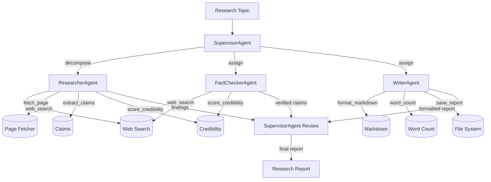

# Deep Research Demo

A production-quality multi-agent research workflow demonstrating every major Nexus framework component. Given a research topic, four specialised agents collaborate to produce a structured, citation-rich report with confidence scores.

## Quick Start

No API key required — uses a deterministic mock client:

```bash
python demos/deep_research/run.py "quantum computing in drug discovery"
```

With a real Anthropic API key:

```bash
ANTHROPIC_API_KEY=sk-ant-... python demos/deep_research/run.py "quantum computing in drug discovery"
```

Via the Nexus CLI (single supervisor agent):

```bash
nexus run demos/deep_research/agent.py --input "AI in medicine"
```

## Running Evals

```bash
# Run all 8 eval cases with the mock client (no API key needed)
python demos/deep_research/eval_suite.py

# Via Nexus CLI with text output
nexus eval demos/deep_research/eval_suite.py --format text

# JUnit output (for CI)
nexus eval demos/deep_research/eval_suite.py --format junit --fail-under 0.75
```

## Memory and Cost Inspection

```bash
# View stored episodic records after a run
nexus memory inspect deep-research-supervisor

# Show cost breakdown for recent sessions
nexus cost --agent deep-research-supervisor
```

## Agent Roles

| Agent | Role | Tools Used | Budget |
|-------|------|-----------|--------|
| **SupervisorAgent** | Decomposes topic, reviews final report | All 9 tools | $2.00 |
| **ResearcherAgent** | Searches sources, extracts claims | web_search, fetch_page, extract_claims, score_credibility, summarize_source | $0.50 |
| **FactCheckerAgent** | Validates claims, assigns confidence scores | web_search, extract_claims, score_credibility | $0.30 |
| **WriterAgent** | Synthesises verified claims into report | format_markdown, word_count, save_report | $0.30 |

## Architecture



## Research Workflow

1. **Supervisor** receives the topic and breaks it into 3 focused sub-questions
2. **Researcher** searches multiple sources, fetches pages (safety-checked), and extracts claims
3. **FactChecker** independently verifies each claim with confidence scoring (0.0–1.0)
4. **Writer** synthesises verified claims (≥0.60 confidence) into structured markdown
5. **Supervisor** reviews the consolidated output and saves the final approved report

The crew uses the **hierarchical** pattern: the supervisor orchestrates workers in parallel, then reviews and consolidates their outputs.

## Framework Components Exercised

- [x] `nexus.orchestration.runner.AgentRunner` — ReAct loop for each agent
- [x] `nexus.orchestration.crew.Crew` — HIERARCHICAL multi-agent coordination
- [x] `nexus.orchestration.cost_tracker.CostTracker` — per-agent budget enforcement
- [x] `nexus.memory.manager.MemoryManager` — episodic + semantic memory
- [x] `nexus.memory.working.WorkingMemory` — in-session context window
- [x] `nexus.memory.episodic.EpisodicMemory` — cross-session research storage
- [x] `nexus.memory.semantic.SemanticMemory` — extracted facts
- [x] `nexus.memory.consolidation.ConsolidationPipeline` — episode → fact extraction
- [x] `nexus.memory.provenance.ProvenanceTracker` — source tracking
- [x] `nexus.tools.registry.ToolRegistry` — 9 tools registered across 3 modules
- [x] `nexus.tools.executor.ToolExecutor` — timeout, retry, idempotency
- [x] `nexus.safety.pipeline.SafetyPipeline` — injection + PII detection
- [x] `nexus.safety.policies.PolicyLoader` — YAML policy configuration
- [x] `nexus.observability.tracer.NexusTracer` — OTEL spans
- [x] `nexus.observability.metrics.NexusMetrics` — Prometheus metrics
- [x] `nexus.observability.events.EventLog` — append-only event log
- [x] `nexus.evaluation.suite.EvalSuite` — 8 eval cases
- [x] `nexus.evaluation.assertions` — 11 assertion types
- [x] `nexus.evaluation.baseline.QualityBaseline` — regression detection

## Tools Reference

### Search Tools (`tools/search.py`)
- **web_search(query, max_results=5)** — Credibility-ranked search results with source scores
- **fetch_page(url)** — Fetches page content, *safety-checked before return*
- **trending_topics(domain)** — Trending topics with momentum scores for science/technology/medicine

### Analysis Tools (`tools/analysis.py`)
- **extract_claims(text, min_confidence=0.5)** — Regex + linguistic heuristic claim extraction
- **score_credibility(source_url, content)** — Domain authority + content signal scoring
- **summarize_source(content, max_words=150)** — TF-IDF extractive summarisation

### Output Tools (`tools/output.py`)
- **format_markdown(sections)** — Structured markdown from section dict
- **word_count(text)** — Words, sentences, Flesch readability score
- **save_report(title, content, format, output_dir)** — Persist to `output/` directory

## Extending the Demo

### Adding a new tool

1. Add the function to the appropriate tool file with `@_registry.tool(...)` decorator
2. Register it in `agent.py`'s `build_registry()` function
3. Add it to the relevant agent's `tools=[...]` list in `agents/`

### Adding a new agent

1. Create `agents/my_agent.py` with `SYSTEM_PROMPT` and `create_my_agent_def()`
2. Add a runner in `agent.py`'s `build_crew()` function
3. Add as a `CrewMember` in the `Crew(...)` constructor

### Adding an eval case

Add an `EvalCase` to `eval/cases.py` using any of the assertion factories:
`contains`, `not_contains`, `matches_regex`, `output_length`, `tool_was_called`,
`tool_not_called`, `tool_call_count`, `max_cost`, `max_steps`, `no_pii`, `no_injection_patterns`

## Safety

`fetch_page` runs all web content through `SafetyPipeline.check_tool_result()` before
returning it to the agent. This is non-negotiable — web content is the primary injection
attack surface for research agents. The safety policy is configured in `config/safety_policy.yaml`.

Reports are saved to `demos/deep_research/output/` with timestamp-prefixed filenames.
