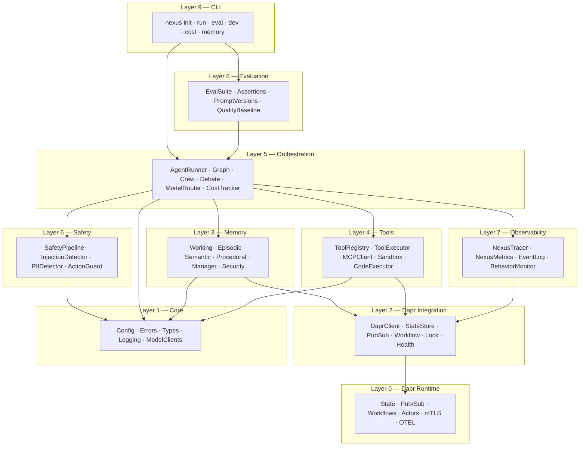
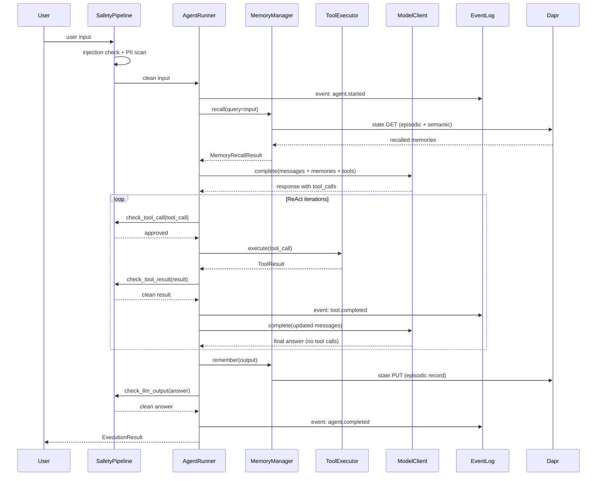

# Architecture Overview

## The 9 layers

Nexus is organized into 9 layers, each with a clear boundary and single responsibility:

---

## Layer descriptions

### Layer 0 — Dapr Runtime

Dapr provides the distributed infrastructure that Nexus runs on. It handles:

- **State management** — PostgreSQL (primary) and Redis (cache) via the Dapr State API
- **Pub/Sub messaging** — Redis Streams for event fanout and behavior monitoring
- **Durable workflows** — checkpoint-based workflow execution for long-running agent tasks
- **Distributed actors** — for stateful per-agent coordination
- **mTLS** — mutual TLS between services, zero-configuration
- **OTEL** — Dapr emits infrastructure-level traces automatically

Nexus never talks to PostgreSQL or Redis directly. All I/O goes through the Dapr sidecar at `http://localhost:3500`.

### Layer 1 — Core

Foundation types that everything else builds on:

- **Config** — `NexusConfig` via pydantic-settings; loads from env vars and YAML
- **Errors** — `NexusError` hierarchy with machine-readable `code` strings
- **Types** — Pydantic v2 models: `AgentDefinition`, `AgentState`, `ExecutionResult`, `Message`, `ToolCall`, `ToolResult`, `TokenUsage`
- **Logging** — structlog with JSON (prod) or console (dev) output, correlation IDs via contextvars
- **Model clients** — `ModelClient` ABC with Anthropic and OpenAI implementations

### Layer 2 — Dapr Integration

Typed Python wrappers around Dapr's APIs:

- **DaprStateStore** — namespace-scoped keys, Pydantic serialization, ETag concurrency, bulk ops, transactions
- **DaprPubSub** — typed publish/subscribe with handler decorators
- **DaprWorkflow** — durable workflow base class with automatic checkpointing
- **Distributed lock** — `async with dapr_lock("resource"): ...`
- **Health check** — verifies sidecar availability before use

### Layer 3 — Memory

Four memory types plus a security layer:

- **Working** — in-session token window with auto-summarization (truncate / summarize / hybrid)
- **Episodic** — cross-session events with embeddings, temporal decay, and importance scoring
- **Semantic** — subject–predicate–object facts with confidence-weighted deduplication
- **Procedural** — learned workflow templates with trigger conditions
- **Consolidation** — async pipeline that extracts semantic facts from episodic records
- **Security** — provenance tracking, trust scoring, injection detection, rate limiting, content hash auditing

All four types are accessed through `MemoryManager` — the orchestration layer never calls individual stores.

### Layer 4 — Tools

Everything needed to safely invoke tools:

- **ToolRegistry** — register tools via `@registry.tool()` decorator, list as JSON schema
- **ToolExecutor** — validation, timeout, retry, idempotency, execution records
- **MCPClient** — discover and invoke tools from MCP-compatible servers
- **SandboxManager** — Docker container isolation for LLM-generated code
- **CodeExecutor** — execute Python in sandbox with registered tools injected as callables
- **ActionGuard** — per-agent allowlist/denylist, rate limiting, cost guard

### Layer 5 — Orchestration

The agent loop and multi-agent coordination:

- **AgentRunner** — ReAct loop (Observe→Think→Act). Integrates memory recall, tool execution, safety checks, cost tracking, state persistence
- **Graph** — DAG-based workflow engine with conditional edges, parallel branches, Dapr checkpoints
- **Pre-built nodes** — `LLMNode`, `ToolNode`, `ConditionalNode`, `HumanNode`, `SubgraphNode`, `debate_node`
- **ModelRouter** — route steps to cheapest capable model by tier (fast/balanced/powerful)
- **CostTracker** — per-model/agent/session/step cost tracking with budget enforcement
- **Crew** — sequential, parallel, and hierarchical multi-agent patterns
- **DebateOrchestrator** — multi-agent debate over a single question: concurrent per-round `asyncio.gather`, Jaccard-similarity convergence detection, adaptive routing (skip when confident), sycophancy-resistant round-2+ prompts, three aggregation strategies (majority vote, weighted vote, judge model), and `escalate_to_human` for low-convergence answers

### Layer 6 — Safety

Runtime safety middleware wrapping every agent action:

- **SafetyPipeline** — composes all checks; configurable per check category
- **PromptInjectionDetector** — regex + heuristic + semantic patterns at three strictness levels
- **PIIDetector** — detect and redact email, phone, SSN, credit card, address
- **ActionGuard** — per-agent tool boundaries, consecutive call limits, cost caps
- **Policy loader** — YAML-based configuration, no code changes required

### Layer 7 — Observability

Three-layer observability:

- **NexusTracer** — OTEL custom spans for every agent action (agent.run, agent.llm_call, agent.tool_call, etc.)
- **NexusMetrics** — Prometheus endpoint with counters, gauges, and histograms
- **EventLog** — append-only, replayable audit log stored in Dapr state
- **BehaviorMonitor** — rolling-window anomaly detection for cost, tool usage, latency

### Layer 8 — Evaluation

Built-in testing for agent behavior:

- **EvalSuite** — collection of `EvalCase` objects run against an `AgentRunner`
- **Assertions** — 16 types: content, tools, performance, budget, safety, LLM-as-judge
- **PromptVersionManager** — track, diff, A/B test, and rollback system prompts
- **QualityBaseline** — pin pass rates and detect regressions
- **Reporters** — text, JSON, JUnit XML for CI integration

### Layer 9 — CLI

Developer experience:

- `nexus init` — scaffold with templates (simple, crew, rag)
- `nexus run` — REPL or single-shot with Dapr sidecar management
- `nexus eval` — run eval suites with pass-rate gating for CI
- `nexus memory` — inspect, clear, and show stats for agent memory
- `nexus cost` — show cost summary across sessions
- `nexus dev` — watch mode with auto-reload and live cost output

---

## Data flow

A single user turn flows through the system as follows:

---

## Design principles

**Async-first**: all I/O uses `async`/`await`. CPU-bound work runs in thread pool executors. This enables high concurrency for I/O-bound agent workflows.

**Dependency injection everywhere**: no global mutable state. Every component receives its dependencies through the constructor. This makes testing trivial — swap real components for fakes without patching.

**Dapr abstracts infrastructure**: agent code never imports `psycopg2`, `redis`, or `aiokafka`. Components are swapped by editing Dapr YAML files, not Python code.

**Safety by default**: the `SafetyPipeline` is always active. To disable a check (e.g., for testing), you must explicitly configure `SafetyPipelineConfig(check_user_input=False)`. There is no silent bypass.

**Provenance on every write**: the memory system rejects writes without provenance metadata at the `DaprStateStore` wrapper level — below application code. This makes provenance non-bypassable without changing framework code.

---

## Next steps

- **[Architecture Decision Records →](decisions.md)** — Why each major design choice was made
- **[Security Model →](security.md)** — Threat model, attack vectors, and defenses
- **[Orchestration API →](../reference/orchestration-api.md)** — `AgentRunner` and `Graph` reference
