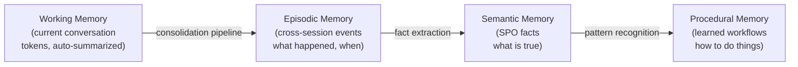
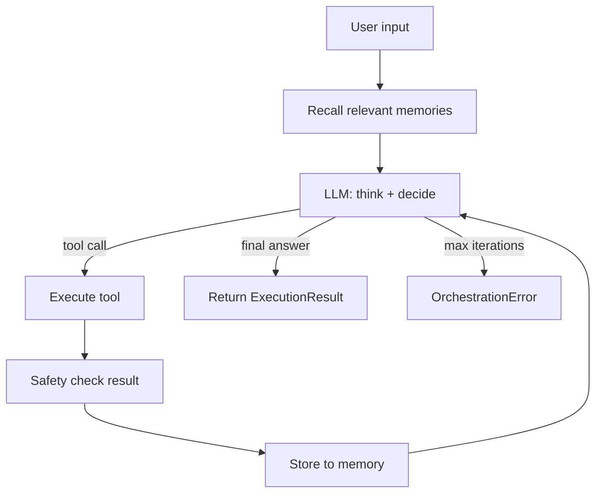
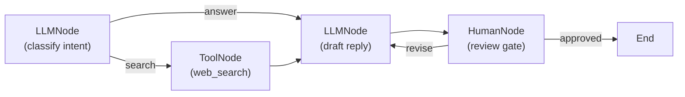
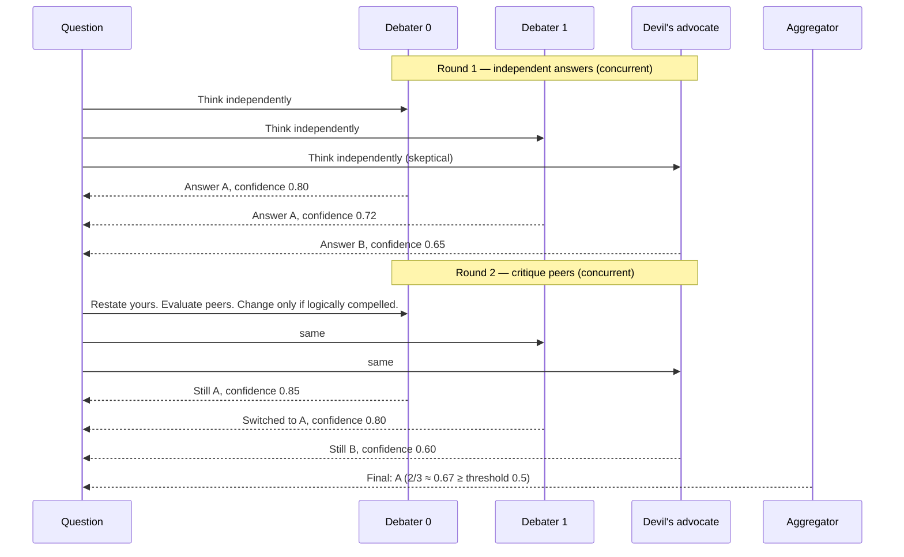
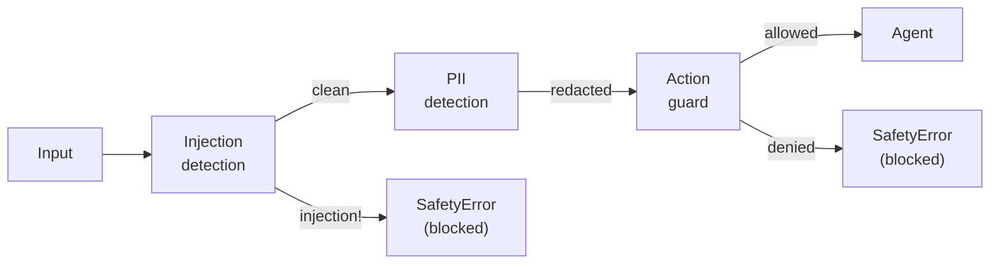
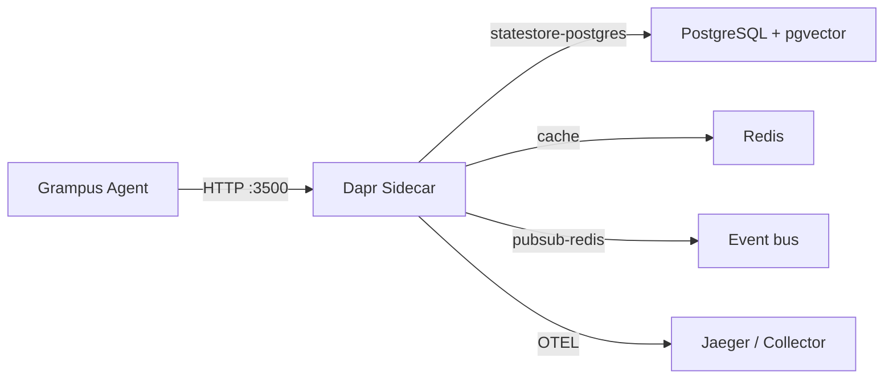

# Concepts

This page explains the mental models behind Grampus. Understanding these concepts will help you design agents that are reliable, safe, and observable.

---

## The 4 memory types

Agents need to remember things at different timescales. Grampus provides four purpose-built memory stores:



| Memory type | Timescale | Stores | Example |
|------------|-----------|--------|---------|
| **Working** | Current session | Recent messages, token-limited | Last 20 turns of conversation |
| **Episodic** | Cross-session | Events with timestamps, embeddings | "On 2025-01-15, user asked about pricing" |
| **Semantic** | Persistent | Subject-Predicate-Object facts | `user → prefers → dark mode` |
| **Procedural** | Persistent | Learned workflows with trigger conditions | Steps to file a support ticket |

The `MemoryManager` provides a unified interface to all four types. You rarely interact with individual stores directly.

---

## The ReAct loop

Every agent run is a loop of **Observe → Think → Act** until the agent produces a final answer or reaches the iteration limit:



Each iteration:

1. Build context from working memory and recalled episodic/semantic memories
2. Call the LLM with the full message history
3. If the LLM requests a tool call: validate, safety-check, execute, safety-check result
4. Append tool result to message history and loop
5. If the LLM returns a final text response: store to memory, return `ExecutionResult`

`AgentRunner` implements this loop. The `max_iterations` guard in `RunnerConfig` prevents infinite loops.

---

## The graph engine

For complex workflows, use the `Graph` engine instead of (or alongside) `AgentRunner`. Nodes are async callables; edges define transitions:



Key properties:

- **Checkpointing**: state is saved to Dapr after each node, so a crashed agent can resume
- **Parallel branches**: independent branches run concurrently
- **Conditional edges**: functions that inspect state determine the next node

---

## Multi-agent debate

For high-stakes questions — legal analysis, medical triage, financial decisions — you can run the same question past a panel of LLMs and let them argue. `DebateOrchestrator` manages the rounds, detects convergence, and aggregates the result.



Key design decisions:

- **Heterogeneous models** beat same-model temperature diversity (M3MAD-Bench, ICLR 2025). Run `haiku + sonnet + sonnet-with-devil's-advocate` rather than three sonnets.
- **Sycophancy resistance** — round 2+ prompts require debaters to restate their prior answer before critiquing peers, and to justify any change with specific evidence (ACL 2025).
- **Adaptive routing** — when a single fast model reports high confidence (≥ 0.85 by default), the full debate is skipped. This eliminates ~40% of unnecessary calls with no quality loss.
- **Escalation** — when the panel still disagrees after all rounds, `escalate_to_human=True` is set on the result. Your graph can route this to a `human_node` for review.

The `debate_node()` factory wires a `DebateOrchestrator` into the graph engine, so escalation routing looks the same as any other conditional edge.

---

## The safety layer

Every piece of text that flows through an agent — user input, tool results, LLM outputs, memory writes — passes through the `SafetyPipeline`:



The pipeline is configured via YAML policies — no code changes needed to tighten or relax safety rules.

!!! warning "Safety is not optional"
    The injection detector runs on **tool results** specifically, because tool output is the most common vector for prompt injection attacks. See [Security Model](../architecture/security.md) for the threat model.

---

## Agent handoffs

Sometimes an agent discovers mid-run that a question is outside its expertise and needs to delegate to a specialist. That is an *agent handoff* — a runtime transfer of control from one agent to another, carrying the accumulated conversation context.

Handoffs differ from [multi-agent crews](../guides/multi-agent-crew.md) in one key way: a crew's composition is decided upfront, before execution starts. A handoff happens dynamically, triggered by the running agent's own judgment. Use handoffs when the routing decision depends on what the user actually says, not what you predict they might say.

Security is built into the handoff layer: context passed to the target agent is tagged as `LLM_GENERATED` (trust 0.7, lower than direct `USER_INPUT` at 0.9), injection patterns are scanned before context is handed over, and `HandoffPolicy.max_depth` prevents infinite agent loops. See the [Agent Handoffs guide →](../guides/agent-handoffs.md)

---

## Dapr as infrastructure

Grampus never writes to databases or message brokers directly. All persistence and messaging goes through the Dapr sidecar:



This means:

- **Swap any component** without changing agent code — switch Redis to Kafka for pub/sub by editing a YAML file
- **mTLS between services** is handled by Dapr automatically
- **Distributed workflows** with checkpointing work out of the box

---

## Provenance

Every memory write carries a `Provenance` record:

```python
Provenance(
    source_type=SourceType.TOOL_RESULT,   # where did this come from?
    source_id="web_search:call_abc123",    # which specific invocation?
    trust_level=0.6,                       # how trusted is this source?
    timestamp=datetime.now(UTC),
    content_hash_sha256="sha256:...",      # tamper detection
)
```

Trust levels by source:

| Source type | Default trust |
|------------|--------------|
| `SYSTEM` | 1.0 |
| `USER_INPUT` | 0.9 |
| `LLM_GENERATED` | 0.7 |
| `TOOL_RESULT` | 0.6 |
| `EXTERNAL_DATA` | 0.3 |

The memory auditor periodically verifies content hashes. Tampered entries are flagged. This is the primary defense against memory poisoning attacks (MINJA, MemoryGraft).

---

## Next steps

- **[Single-agent guide →](../guides/single-agent.md)** — Put all these concepts together
- **[Memory guide →](../guides/memory.md)** — Deep dive into all four memory types
- **[Architecture overview →](../architecture/overview.md)** — Full 9-layer diagram and narrative