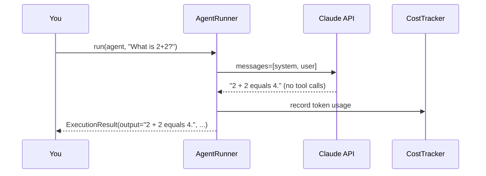

# Quickstart

Build and run your first Nexus agent in 5 minutes.

## What you'll build

A simple conversational agent powered by Claude that answers questions and reports the cost of each interaction.

---

## Step 1 — Scaffold the project

```bash
nexus init hello-agent
cd hello-agent
```

This creates the following structure:

```
hello-agent/
├── agent.py              # Your agent code
├── nexus.yaml            # Project configuration
├── docker-compose.yml    # Local infrastructure
├── dapr/
│   └── components/       # Dapr component YAML files
└── .gitignore
```

---

## Step 2 — Review the configuration

Open `nexus.yaml`:

```yaml
# nexus.yaml — project configuration
model:
  default_model: claude-sonnet-4-6       # LLM to use by default
  temperature: 0.0                        # Deterministic output
  max_tokens: 4096                        # Max tokens per response

memory:
  working_memory_token_limit: 100000      # Context window size
  summarization_strategy: hybrid          # truncate | summarize | hybrid
  episodic_top_k: 5                       # Memories recalled per query

safety:
  injection_detection_level: balanced     # strict | balanced | permissive
  pii_detection_enabled: true             # Redact PII in outputs

dapr:
  host: localhost
  port: 3500                              # Dapr HTTP sidecar port

observability:
  otel_enabled: true
  log_level: INFO
```

---

## Step 3 — Write the agent

Replace the contents of `agent.py` with:

```python
import asyncio
import os

from nexus.core.models.anthropic import AnthropicClient
from nexus.core.types import AgentDefinition
from nexus.orchestration.runner import AgentRunner, RunnerConfig
from nexus.tools.executor import ToolExecutor
from nexus.tools.registry import ToolRegistry


def create_runner() -> AgentRunner:
    """Factory function called by `nexus run`."""
    client = AnthropicClient(api_key=os.environ["NEXUS_MODEL__ANTHROPIC_API_KEY"])
    registry = ToolRegistry()
    executor = ToolExecutor(registry)
    config = RunnerConfig(max_iterations=5, enable_memory=False)
    return AgentRunner(model_client=client, tool_executor=executor, config=config)


def create_agent_def() -> AgentDefinition:
    """Agent blueprint called by `nexus run`."""
    return AgentDefinition(
        name="hello",
        model="claude-sonnet-4-6",
        system_prompt="You are a helpful assistant. Answer concisely.",
    )


async def main() -> None:
    runner = create_runner()
    agent = create_agent_def()

    result = await runner.run(agent, "What is 2 + 2?", session_id="quickstart-1")

    print(f"Output:   {result.output}")
    print(f"Steps:    {result.steps_taken}")
    print(f"Tokens:   {result.token_usage.total_tokens}")
    print(f"Cost:     ${result.token_usage.cost_usd:.6f}")


if __name__ == "__main__":
    asyncio.run(main())
```

---

## Step 4 — Start infrastructure

```bash
docker compose up -d
```

---

## Step 5 — Run the agent

=== "Single-shot mode"

    ```bash
    nexus run agent.py --input "What is 2 + 2?"
    ```

=== "Interactive REPL"

    ```bash
    nexus run agent.py
    # > What is 2 + 2?
    # 2 + 2 equals 4.
    # > What about 3 * 7?
    # 3 × 7 = 21.
    # > exit
    ```

=== "Direct Python"

    ```bash
    uv run python agent.py
    ```

Expected output:

```
Output:   2 + 2 equals 4.
Steps:    1
Tokens:   42
Cost:     $0.000013
```

---

## What just happened?



The `AgentRunner` ran one iteration of the ReAct loop: it sent your input to the LLM, received a final answer (no tool calls needed), and returned the `ExecutionResult`.

---

## Next steps

- **[Single-agent guide →](../guides/single-agent.md)** — Add tools, memory, and safety to build a research agent
- **[Memory guide →](../guides/memory.md)** — Persist knowledge across sessions
- **[CLI reference →](../reference/cli.md)** — All `nexus` commands and flags