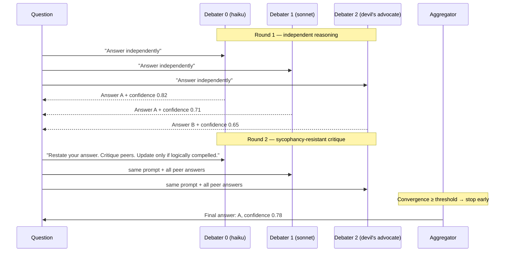

# Multi-Agent Debate

Multi-agent debate runs the same question past several LLMs simultaneously, lets them critique each other's reasoning, then aggregates the results into a single high-confidence answer. Use it when a single LLM call is not reliable enough — factual questions with high stakes, decisions with legal or financial impact, or any case where you need an auditable confidence score alongside the answer.

---

## When to use debate vs. crew

| | [Crew](multi-agent-crew.md) | Debate |
|---|---|---|
| **Structure** | Pipeline — each agent does a different job | Panel — all agents answer the same question |
| **Composition** | Decided before execution | Configured via `DebateConfig` |
| **Output** | Accumulated outputs from N agents | Single aggregated answer + confidence score |
| **Cost model** | Sequential; stops at each member | Concurrent per round; early-stops when agents agree |
| **Best for** | Research → critique → write pipelines | High-stakes Q&A, fact-checking, uncertain classifications |

---

## Prerequisites

```bash
pip install "nexus-ai[anthropic]"   # or openai, gemini
```

Debate uses whatever model clients you already configure — no additional dependencies.

---

## Minimal example

```python
import asyncio
import os

from nexus.core.models.anthropic import AnthropicClient
from nexus.orchestration.debate import (
    AggregationStrategy,
    DebateConfig,
    DebaterConfig,
    DebateOrchestrator,
)


async def main() -> None:
    client = AnthropicClient(api_key=os.environ["NEXUS_MODEL__ANTHROPIC_API_KEY"])

    cfg = DebateConfig(
        debaters=[
            DebaterConfig(model_client=client, model_id="claude-haiku-4-5", temperature=0.5),
            DebaterConfig(model_client=client, model_id="claude-sonnet-4-6", temperature=0.7),
            DebaterConfig(
                model_client=client,
                model_id="claude-sonnet-4-6",
                temperature=0.9,
                role_hint="You are a skeptical devil's advocate.",
            ),
        ],
        max_rounds=3,
        aggregation=AggregationStrategy.WEIGHTED_VOTE,
    )

    orch = DebateOrchestrator(cfg)
    result = await orch.run("Is the following contract clause legally enforceable in California?  ...")

    print(f"Answer:     {result.final_answer}")
    print(f"Confidence: {result.confidence:.0%}")
    print(f"Rounds run: {result.total_rounds_run}")
    print(f"Cost:       ${result.total_cost_usd:.4f}")

    if result.escalate_to_human:
        print("⚠ Low confidence — flagged for human review")


asyncio.run(main())
```

---

## How it works

### Round structure



All debaters in each round run **concurrently** via `asyncio.gather`. Round N starts only after all of round N-1's positions are in.

### Adaptive routing

When `adaptive_routing=True` (the default), the orchestrator first sends the question to a single fast model and checks the reported confidence. If confidence ≥ `routing_confidence_threshold` (default 0.85), the full debate is skipped and that answer is returned immediately with `routing_decision=SINGLE_AGENT`. This eliminates ~40% of unnecessary debate calls with no quality loss (arXiv 2504.05047).

```python
cfg = DebateConfig(
    ...,
    adaptive_routing=True,
    routing_confidence_threshold=0.85,     # skip debate if this confident
    routing_model_client=haiku_client,     # fast model for the routing check
    routing_model_id="claude-haiku-4-5",
)
```

### Sycophancy resistance

A known failure mode in multi-agent debate is *sycophancy*: agents flip their position not because of logic, but because of social pressure from peers (ACL 2025 CONSENSAGENT). Nexus mitigates this with a mandatory three-step prompt for rounds 2+:

1. **Restate** your previous answer verbatim
2. **Critique** each peer position based on evidence
3. **Update** only if there is a compelling logical reason — and explicitly state that reason

Position changes are tracked in `DebaterPosition.changed_from_previous` and `change_justification`.

### Convergence detection

After each round, a `ConvergenceDetector` clusters positions by Jaccard word-overlap similarity. Two answers are considered equivalent if their word-set Jaccard score ≥ 0.4. The convergence score is:

```
score = size_of_largest_cluster / total_debaters
```

When `score >= convergence_threshold` (default 0.8), the debate stops early. This is `stopped_early=True` on the final `DebateRound`.

### Escalation to humans

When the final convergence score is below `escalate_threshold` (default 0.5), the result sets `escalate_to_human=True`. This surfaces low-confidence cases rather than silently returning a guess ("From Debate to Decision", April 2026).

---

## Aggregation strategies

### Majority vote (fast baseline)

```python
aggregation=AggregationStrategy.MAJORITY_VOTE
```

Finds the largest Jaccard-similarity cluster in the final round. The position with the highest self-reported confidence in that cluster is the representative. Returns the average cluster confidence.

### Weighted vote (recommended)

```python
aggregation=AggregationStrategy.WEIGHTED_VOTE

# Assign higher weight to your most capable debater
DebaterConfig(..., weight=2.0)   # this debater's vote counts double
```

Scores each cluster by `sum(debater.weight × position.confidence)`. Picks the highest-scoring cluster. This lets you bias toward a more capable model without fully excluding others.

### Judge model (highest quality)

```python
from nexus.orchestration.debate import DebaterConfig, AggregationStrategy

judge_cfg = DebaterConfig(
    model_client=opus_client,
    model_id="claude-opus-4-7",
    temperature=0.0,
)

cfg = DebateConfig(
    ...,
    aggregation=AggregationStrategy.JUDGE,
    judge_config=judge_cfg,
)
```

After all rounds, a separate judge model receives all final-round positions verbatim and synthesises a single answer with explicit reasoning. Falls back to majority vote if the judge returns non-parseable output.

---

## Integrating with the Graph engine

`debate_node()` wraps a `DebateOrchestrator` as a graph node, and optionally routes low-confidence results to a human review node:

```python
from nexus.orchestration import Graph, debate_node, human_node

orch = DebateOrchestrator(cfg)

async def route(state):
    return "escalate" if state.metadata.get("debate_escalate") else "end"

graph = (
    Graph(graph_id="contract-review")
    .add_node("debate", debate_node(orch, on_escalate="human_review"), entry=True)
    .add_conditional_edge("debate", route, {"escalate": "human_review", "end": None})
    .add_node("human_review", human_node("Low-confidence answer — please review."))
)

result = await graph.execute(initial_state)
```

After the debate node runs, the last ASSISTANT message contains:

```python
message.metadata["debate_result"]      # full DebateResult dict
message.metadata["debate_confidence"]  # float
message.metadata["debate_escalate"]    # bool — True when human review needed
message.metadata["debate_rounds"]      # int
message.metadata["debate_routing"]     # "debate" or "single_agent"
```

---

## Budget enforcement

Pass a `CostTracker` to cap total spend across all debate rounds:

```python
from nexus.orchestration import CostTracker

tracker = CostTracker(agent_id="qa-agent", session_id="s1", budget_usd=0.05)
orch = DebateOrchestrator(cfg, cost_tracker=tracker)
```

The orchestrator calls `check_budget()` before each round. If the budget is exhausted, `BudgetExceededError` is raised immediately.

---

## Observability

Every debate emits structured OTEL spans:

| Span | Key attributes |
|------|---------------|
| `debate.run` | `question_len`, `num_debaters`, `max_rounds`, `aggregation`, `adaptive_routing` |
| `debate.route_check` | `routing_model_id`, `confidence`, `decision` |
| `debate.round` | `round_number`, `convergence_score`, `stopped_early` |
| `debate.debater` | `debater_index`, `model_id`, `confidence`, `changed` |
| `debate.aggregate` | `strategy`, `final_confidence`, `escalate_to_human` |

Pass any tracer with a `span(name, **attrs)` context manager interface:

```python
from nexus.observability.tracer import NexusTracer

tracer = NexusTracer(service_name="my-agent", otlp_endpoint="http://localhost:4317")
orch = DebateOrchestrator(cfg, tracer=tracer)
```

---

## Configuration reference

### DebateConfig

| Field | Type | Default | Description |
|-------|------|---------|-------------|
| `debaters` | `list[DebaterConfig]` | required (min 2) | Panel of debaters |
| `max_rounds` | `int` | `3` | Maximum debate rounds before forced aggregation |
| `aggregation` | `AggregationStrategy` | `WEIGHTED_VOTE` | How to pick the winner |
| `convergence_threshold` | `float` | `0.8` | Fraction of debaters that must agree to stop early |
| `adaptive_routing` | `bool` | `True` | Skip debate when single-agent confidence is high |
| `routing_confidence_threshold` | `float` | `0.85` | Confidence that triggers routing bypass |
| `routing_model_client` | `ModelClient \| None` | `None` → debaters[0] | Fast model for routing check |
| `routing_model_id` | `str` | `""` → debaters[0] | Model ID for routing check |
| `judge_config` | `DebaterConfig \| None` | `None` | Required when `aggregation=JUDGE` |
| `cost_budget_usd` | `float \| None` | `None` | Hard budget ceiling across all rounds |
| `escalate_threshold` | `float` | `0.5` | Set `escalate_to_human=True` when convergence below this |

### DebaterConfig

| Field | Type | Default | Description |
|-------|------|---------|-------------|
| `model_client` | `ModelClient` | required | Any Nexus model client |
| `model_id` | `str` | required | Model identifier string |
| `temperature` | `float` | `0.7` | Sampling temperature |
| `role_hint` | `str` | `""` | Appended to the system prompt — use for adversarial personas |
| `weight` | `float` | `1.0` | Vote weight for `WEIGHTED_VOTE` aggregation |

### DebateResult fields

| Field | Type | Description |
|-------|------|-------------|
| `final_answer` | `str` | Aggregated winning answer |
| `final_reasoning` | `str` | Reasoning from the winning position |
| `confidence` | `float` | Aggregated confidence score (0–1) |
| `escalate_to_human` | `bool` | `True` when convergence < `escalate_threshold` |
| `rounds` | `list[DebateRound]` | Full per-round transcript |
| `routing_decision` | `RoutingDecision` | `"debate"` or `"single_agent"` |
| `total_rounds_run` | `int` | Rounds actually run (may be < `max_rounds` due to early stop) |
| `converged` | `bool` | Whether early stopping triggered |
| `final_convergence_score` | `float` | Convergence in the final round |
| `total_token_usage` | `TokenUsage` | Cumulative tokens across all rounds |
| `total_cost_usd` | `float` | Total spend across all rounds |
| `duration_seconds` | `float` | Wall-clock time |

---

## Design notes

**Use heterogeneous models** — different model families outperform the same model at varied temperatures. At identical question difficulty, `claude-haiku + claude-sonnet + claude-opus` consistently beats `claude-sonnet × 3` (M3MAD-Bench, ICLR 2025).

**Three debaters is usually enough** — beyond five debaters, cost grows linearly while accuracy improvement diminishes. Start with three: a fast model, a balanced model, and one with a devil's advocate `role_hint`.

**Trust confidence, not consensus** — `WEIGHTED_VOTE` with tuned weights outperforms pure majority in ambiguous cases. If you have a model you trust more, give it a weight of 2–3× to let it break ties.

**Watch the escalation rate** — if `escalate_to_human=True` fires too often, either reduce `escalate_threshold` or increase `max_rounds`. If it fires too rarely, reduce the threshold.

---

## Next steps

- **[Multi-Agent Crew →](multi-agent-crew.md)** — Sequential pipeline patterns (researcher → critic → writer)
- **[Agent Handoffs →](agent-handoffs.md)** — Runtime delegation between agents
- **[Cost Management →](cost-management.md)** — Budget enforcement and spend reporting
- **[Orchestration API →](../reference/orchestration-api.md)** — Full `DebateOrchestrator` reference
