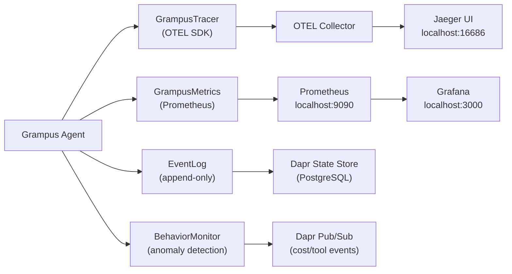

# Observability Guide

## What you'll learn

- OTEL distributed tracing for agent runs
- Prometheus metrics and Grafana dashboards
- The append-only event log for audit and replay
- Behavior monitoring and anomaly detection
- Setting up Jaeger locally with Docker Compose

---

## Architecture overview



---

## OTEL tracing

### Setup

```python
from grampus.observability.tracer import GrampusTracer

tracer = GrampusTracer(
    service_name="research-agent",
    otel_endpoint="http://localhost:4317",   # OTEL Collector gRPC
    enabled=True,
)
```

### Span types

Every significant agent action produces a span. Spans are nested under a session-level parent:

| Span type | Triggered by | Key attributes |
|-----------|-------------|----------------|
| `agent.run` | `AgentRunner.run()` | `agent.name`, `agent.model`, `session.id` |
| `agent.llm_call` | Each LLM API request | `model`, `input_tokens`, `output_tokens`, `cost_usd`, `stop_reason` |
| `agent.tool_call` | Each tool execution | `tool.name`, `tool.duration_ms`, `tool.success` |
| `agent.memory_read` | `MemoryManager.recall()` | `memory.type`, `memory.query`, `memory.results_count` |
| `agent.memory_write` | `MemoryManager.remember()` | `memory.type`, `memory.source_type`, `memory.trust_level` |
| `agent.decision` | End of each ReAct iteration | `agent.step`, `decision.action` (tool_call vs final_answer) |

### Manual spans (for custom code)

```python
with tracer.span("agent.custom_step", attributes={"step.name": "validate_input"}):
    validated = validate_user_input(user_input)
```

### Viewing traces in Jaeger

Navigate to `http://localhost:16686`. Select service `research-agent`. Each agent run appears as a root span `agent.run` with nested child spans:

```
agent.run  (session-42, 2.3s)
├── agent.memory_read  (0.05s)  query="capital of Brazil"
├── agent.llm_call     (0.8s)   model=claude-sonnet-4-6, tokens=312, cost=$0.0002
├── agent.tool_call    (0.3s)   tool=web_search
├── agent.memory_write (0.02s)  type=episodic
└── agent.llm_call     (0.9s)   model=claude-sonnet-4-6, tokens=489, cost=$0.0003
```

---

## Prometheus metrics

### Expose the metrics endpoint

```python
from grampus.observability.metrics import GrampusMetrics

metrics = GrampusMetrics(port=9090)
await metrics.start()   # starts /metrics HTTP server
```

### Available metrics

**Counters** (cumulative, ever-increasing):

| Metric | Labels | Description |
|--------|--------|-------------|
| `nexus_tokens_total` | `model`, `agent_name`, `token_type` | Total tokens consumed |
| `nexus_cost_usd_total` | `model`, `agent_name` | Total USD spent |
| `nexus_tool_calls_total` | `tool_name`, `agent_name`, `status` | Tool executions |
| `nexus_errors_total` | `error_code`, `agent_name` | Errors by type |
| `nexus_agent_runs_total` | `agent_name`, `status` | Agent run completions |

**Gauges** (current snapshot):

| Metric | Labels | Description |
|--------|--------|-------------|
| `grampus_active_agents` | `agent_name` | Currently running agents |

**Histograms** (latency distributions):

| Metric | Labels | Description |
|--------|--------|-------------|
| `grampus_llm_latency_seconds` | `model`, `agent_name` | LLM call duration |
| `grampus_tool_latency_seconds` | `tool_name`, `agent_name` | Tool execution duration |
| `nexus_agent_run_duration_seconds` | `agent_name` | Full agent run duration |

### Sample Grafana queries

```promql
# Average LLM latency per model (last 5 minutes)
rate(grampus_llm_latency_seconds_sum[5m]) / rate(grampus_llm_latency_seconds_count[5m])

# Token cost rate (USD per hour)
rate(nexus_cost_usd_total[1h]) * 3600

# Tool error rate
rate(nexus_errors_total{error_code=~"tool.*"}[5m])

# P99 agent run duration
histogram_quantile(0.99, rate(nexus_agent_run_duration_seconds_bucket[5m]))
```

---

## Event log

The event log captures every agent action as an immutable, append-only record. It provides full audit trails and supports forensic debugging ("why did the agent do X at step 5?").

```python
from grampus.observability.events import EventLog

event_log = EventLog(state_store=state_store)

# Query events for a session
events = await event_log.get_events(session_id="session-42")
for event in events:
    print(f"[{event.timestamp}] {event.event_type}: {event.summary}")
```

### Event types

| Event type | Triggered by |
|-----------|-------------|
| `agent.started` | `AgentRunner.run()` called |
| `agent.completed` | Successful `ExecutionResult` returned |
| `agent.failed` | Unhandled exception in runner |
| `llm.called` | LLM API request sent |
| `llm.responded` | LLM API response received |
| `tool.called` | `ToolExecutor.execute()` called |
| `tool.completed` | Tool returned result |
| `tool.failed` | Tool raised exception |
| `memory.read` | `MemoryManager.recall()` called |
| `memory.written` | `MemoryManager.remember()` called |
| `safety.violation` | Safety check detected an issue |

### Replay events

Events can be replayed to reconstruct the exact state at any point in a run:

```python
# Reconstruct state at step 3
state_at_step_3 = await event_log.replay_to_step(
    session_id="session-42",
    step=3,
)
print(f"Messages at step 3: {len(state_at_step_3.messages)}")
```

---

## Behavior monitor

The `BehaviorMonitor` tracks agent behavior patterns over time and alerts on anomalies.

```python
from grampus.observability.behavior import BehaviorMonitor

monitor = BehaviorMonitor(
    agent_name="research-agent",
    window_hours=24,         # analyze behavior over last 24 hours
    alert_threshold=2.5,     # alert if metric exceeds 2.5× rolling average
)
```

### Monitored patterns

| Pattern | What triggers an alert |
|---------|----------------------|
| Tool usage shift | Tool X called 3× more or less than baseline |
| Cost spike | Cost per run exceeds 2.5× rolling average |
| Memory access anomaly | Memory reads from unusual sources |
| Error rate spike | Error rate exceeds baseline by 2.5× |
| Latency spike | P95 latency exceeds 2.5× baseline |

### Checking for anomalies

```python
anomalies = await monitor.detect_anomalies(session_id="session-42")
for anomaly in anomalies:
    print(f"  [{anomaly.severity}] {anomaly.pattern}: {anomaly.description}")
    print(f"  Current: {anomaly.current_value:.2f}, Baseline: {anomaly.baseline_value:.2f}")
```

---

## Local Jaeger setup

Add to `docker-compose.yml`:

```yaml
services:
  jaeger:
    image: jaegertracing/all-in-one:1.62
    ports:
      - "16686:16686"   # Jaeger UI
      - "4317:4317"     # OTEL gRPC
      - "4318:4318"     # OTEL HTTP
    environment:
      COLLECTOR_OTLP_ENABLED: "true"
```

Then configure Grampus to send traces:

```yaml
# grampus.yaml
observability:
  otel_enabled: true
  otel_endpoint: http://localhost:4317
  log_level: INFO
  metrics_enabled: true
```

Start everything:

```bash
docker compose up -d
```

Open the Jaeger UI at `http://localhost:16686`.

---

## Grafana dashboard

A pre-built 14-panel Grafana dashboard is included at `grafana/dashboards/grampus-overview.json`. It auto-provisions when you start the Grafana stack:

```bash
docker compose -f grafana/docker-compose.grafana.yml up -d
# Open http://localhost:3000  (default login: admin / admin)
# Dashboard auto-provisions under the "Grampus" folder
```

### Dashboard panels

| Panel | Type | Description |
|-------|------|-------------|
| Agent throughput | Time series | Runs completed per minute |
| LLM call rate | Time series | Model API calls per minute |
| P50 LLM latency | Stat | 50th percentile LLM response time |
| P95 LLM latency | Stat | 95th percentile LLM response time |
| P99 LLM latency | Stat | 99th percentile LLM response time |
| LLM latency histogram | Heatmap | Full latency distribution over time |
| Cost per model | Bar chart | Cumulative USD spend broken down by model |
| Active agents | Gauge | Current count of running agent sessions |
| Error rate | Time series | Errors per minute by error type |
| Tool call rate | Time series | Tool executions per minute |
| Tool success rate | Stat | Percentage of tool calls that succeeded |
| Tokens per run (avg) | Stat | Average total tokens per agent run |
| Session cost (avg) | Stat | Average USD per session |
| Top tools by call count | Table | Most-used tools ranked by invocation count |

### Template variables

The dashboard includes two template variables you can use to filter all panels:

- **`$datasource`** — switch between Prometheus instances
- **`$agent_id`** — filter all panels to a specific agent ID (empty = all agents)

---

## Prometheus metrics endpoint

The Grampus server exposes a Prometheus-compatible metrics endpoint at `GET /metrics`. Point your Prometheus scrape config at it:

```yaml
# prometheus.yml
scrape_configs:
  - job_name: grampus
    static_configs:
      - targets: ["localhost:8000"]
    metrics_path: /metrics
```

### Available metrics

**Counters** (ever-increasing, reset on restart):

| Metric | Labels | Description |
|--------|--------|-------------|
| `nexus_llm_calls_total` | `agent_id`, `model` | Total LLM API calls made |
| `nexus_tool_calls_total` | `agent_id`, `tool_name` | Total tool executions |
| `nexus_cost_usd_total` | `agent_id`, `model` | Cumulative USD spend |
| `nexus_errors_total` | `agent_id` | Total errors by agent |

**Gauges** (current snapshot):

| Metric | Labels | Description |
|--------|--------|-------------|
| `grampus_active_agents` | — | Number of currently running agent sessions |

**Histograms** (latency distributions with `_bucket`, `_sum`, `_count` suffixes):

| Metric | Labels | Description |
|--------|--------|-------------|
| `grampus_llm_latency_seconds` | `agent_id`, `model` | LLM API call duration |
| `grampus_tool_latency_seconds` | `agent_id`, `tool_name` | Tool execution duration |

---

## Next steps

- **[Observability API reference →](../reference/observability-api.md)** — Full `GrampusTracer` and `GrampusMetrics` reference
- **[Evaluation guide →](evaluation.md)** — Correlate eval results with traces
- **[Deployment guide →](deployment.md)** — Configure OTEL for Kubernetes
