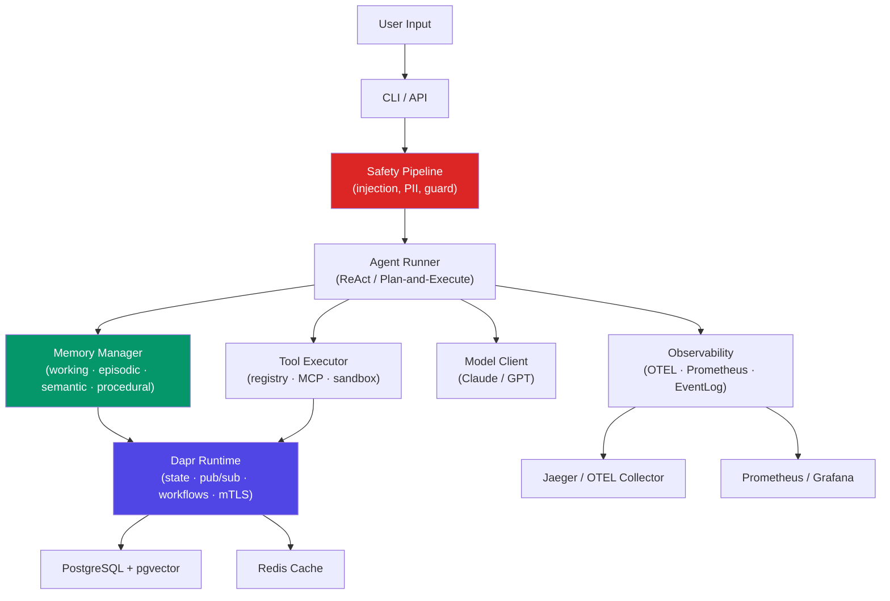

# Nexus — Agentic AI Framework

**As simple as CrewAI to start. As powerful as LangGraph for production.**

Nexus is an open-source agentic AI framework built on [Dapr's](https://dapr.io) distributed runtime. It provides agent intelligence — memory, orchestration, safety, observability, and evaluation — while Dapr handles the infrastructure: state, pub/sub, workflows, security, and scaling.

---

## Quick Install

```bash
pip install nexus-ai
nexus init my-agent
cd my-agent && nexus run agent.py --input "Hello"
```

---

## Why Nexus?

<div class="grid cards" markdown>

-   :brain: **Four-Layer Memory**

    Working memory (token window), episodic (cross-session events), semantic (SPO facts), and procedural (learned workflows) — all secured with provenance tracking and poisoning defense.

    [Memory guide →](guides/memory.md)

-   :shield: **Safety by Default**

    Multi-layer prompt injection detection, PII redaction, and action boundaries wrap every LLM call, tool result, and memory write. Configure via YAML policies.

    [Safety guide →](guides/safety.md)

-   :rocket: **Production-Ready**

    Built on Dapr for durable execution, OTEL for distributed tracing, and Prometheus for metrics. Deploy locally, on Docker Compose, or Kubernetes with identical agent code.

    [Deployment guide →](guides/deployment.md)

</div>

---

## Architecture



---

## Feature Highlights

| Feature | Description |
|---------|-------------|
| **ReAct Agent Loop** | Built-in Observe→Think→Act loop with configurable max iterations |
| **Graph Engine** | Multi-node workflows with conditional branching and Dapr checkpoints |
| **Multi-Agent Crews** | Sequential, parallel, and hierarchical crew patterns |
| **Multi-Agent Debate** | Panel of heterogeneous models debate the same question; adaptive early-stop, sycophancy-resistant prompting, three aggregation strategies, and `escalate_to_human` for low-confidence answers |
| **Agent Handoffs** | Runtime agent-to-agent delegation with A2A protocol discovery and injection-sanitized context |
| **Memory Security** | Content hashing, provenance tracking, injection detection, rate limiting |
| **Tool Sandboxing** | Docker-isolated execution, resource limits, network control |
| **MCP Client** | Discover and invoke tools from any MCP-compatible server |
| **Eval Framework** | 16 assertion types, streaming quality assertions, LLM-as-judge, A/B prompt testing, regression detection |
| **Cost Tracking** | Per-model, per-agent, per-session budget enforcement with Slack/email/webhook alerts |
| **Google Gemini** | Native Gemini client (`gemini-2.0-flash`, `gemini-1.5-pro`) alongside Anthropic and OpenAI |
| **Local Models** | Ollama client for zero-cost local inference with any pulled model |
| **Agent State Snapshots** | Export/import full session state for debugging, migration, and eval baselines |
| **Grafana Dashboard** | Pre-built 14-panel dashboard for agent throughput, latency, cost, and errors |
| **Prompt Playground** | Interactive CLI REPL for testing prompts and comparing models (`nexus playground`) |
| **Web UI** | Built-in HTMX interface at `/ui/` for memory inspection and monitoring |

---

## Get Started

1. **[Installation](getting-started/installation.md)** — Prerequisites, pip/uv install, Dapr setup
2. **[Quickstart](getting-started/quickstart.md)** — First agent in 5 minutes
3. **[Concepts](getting-started/concepts.md)** — Mental model for memory, loops, and safety